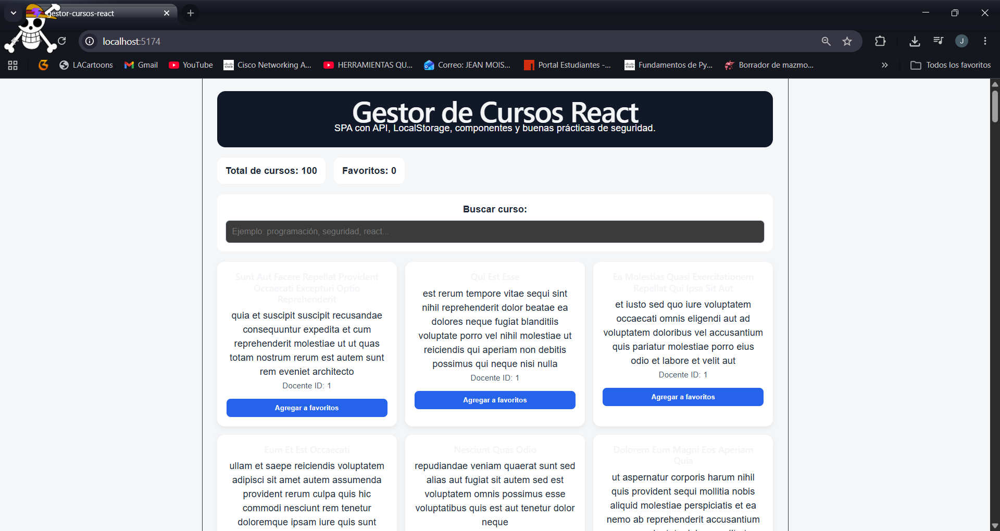
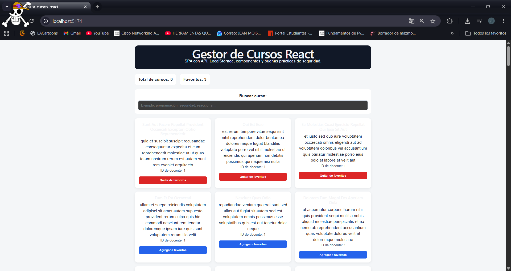
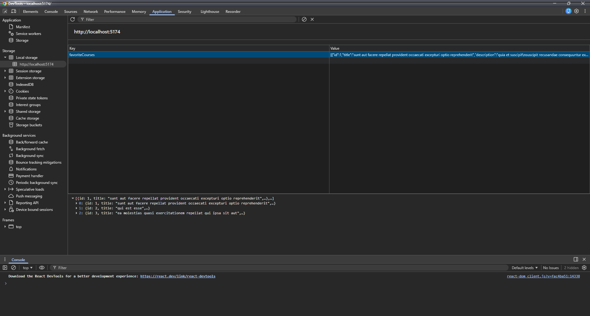
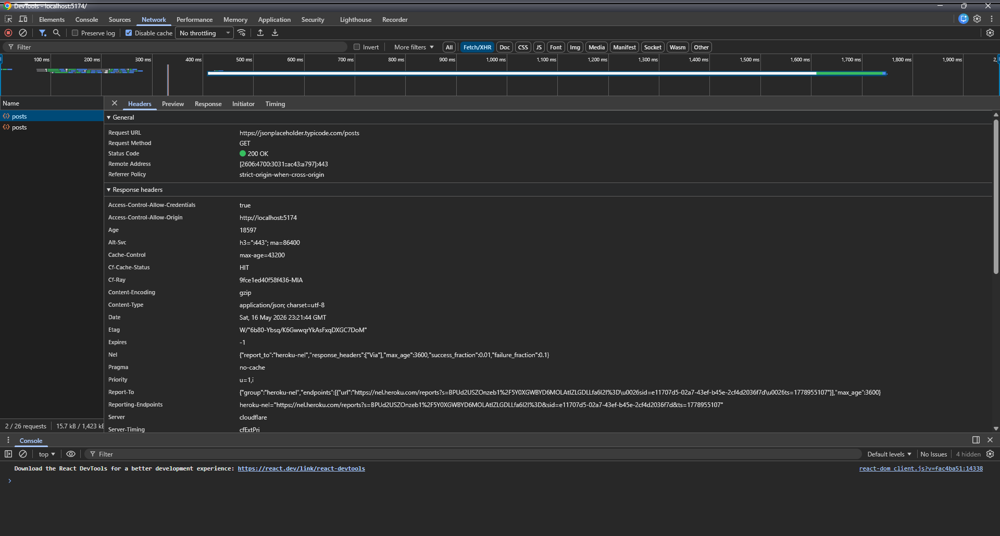
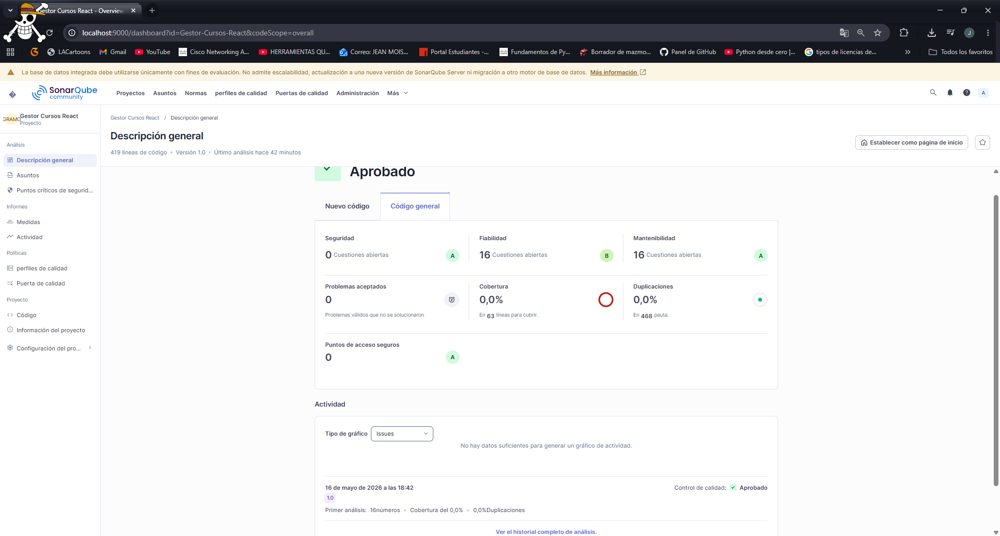

# 📚 Gestor de Cursos React

Aplicación web SPA desarrollada en React que permite consumir datos desde una API externa, buscar cursos, marcar favoritos y aplicar buenas prácticas de seguridad frontend.

🔗 **Repositorio:** https://github.com/JeanS30/GESTOR-CURSOS-REACT

---

## 🚀 Tecnologías utilizadas

- React + Vite
- JavaScript
- Axios
- LocalStorage
- JSONPlaceholder API
- CSS3
- SonarQube (análisis de calidad)

---

## 📁 Estructura del proyecto

```
src/
├── components/
│   ├── CourseCard.jsx
│   ├── CourseList.jsx
│   ├── SearchBar.jsx
│   └── Header.jsx
├── hooks/
│   └── useLocalStorage.js
├── services/
│   └── courseService.js
├── utils/
│   └── sanitize.js
├── App.jsx
├── App.css
└── main.jsx
```

---

## 🧩 Explicación de componentes

### `Header.jsx`
Componente visual que muestra el título principal de la aplicación y una descripción breve. No recibe props.

### `SearchBar.jsx`
Componente de búsqueda controlado. Recibe `searchTerm` y `onSearchChange` como props. Incluye validación con `maxLength={50}` para evitar entradas excesivas.

### `CourseCard.jsx`
Muestra la información de cada curso: título, descripción, ID del docente y botón para agregar o quitar de favoritos. Utiliza `sanitizeText()` para sanitizar los datos antes de renderizarlos.

### `CourseList.jsx`
Renderiza la lista completa de `CourseCard`. Verifica si cada curso está en favoritos usando `.some()` y muestra un mensaje si no hay resultados.

### `useLocalStorage.js`
Hook personalizado que guarda y lee datos del `localStorage` del navegador usando `useState` y `useEffect`. Se usa para persistir los favoritos entre sesiones.

### `courseService.js`
Servicio que consume la API de JSONPlaceholder usando `axios` y `async/await`. Mapea los posts como cursos con `id`, `title`, `description` y `teacherId`.

### `sanitize.js`
Función utilitaria que reemplaza los caracteres `<` y `>` por sus equivalentes HTML seguros, evitando inyecciones de código malicioso.

---

## 🌐 API utilizada

**JSONPlaceholder** — API pública gratuita para pruebas.

```
https://jsonplaceholder.typicode.com/posts
```

Cada elemento devuelto tiene esta estructura JSON:

```json
{
  "userId": 1,
  "id": 1,
  "title": "titulo del curso",
  "body": "descripcion del curso"
}
```

---

## 📸 Capturas de la aplicación

### Aplicación funcionando con cursos cargados


### Favoritos marcados


### LocalStorage con favoritos guardados


### Evidencia de consumo de API (Network)


### Reporte de SonarQube


---

## 📊 Resultados SonarQube

| Métrica | Resultado |
|---|---|
| Puerta de calidad | ✅ Aprobado |
| Seguridad | 🟢 A — 0 cuestiones |
| Mantenibilidad | 🟢 A — 16 cuestiones menores |
| Fiabilidad | 🟡 B — 16 cuestiones |
| Duplicaciones | ✅ 0.0% |
| Líneas de código | 419 |

---

## 🔒 Buenas prácticas de seguridad aplicadas

| Práctica | Descripción |
|---|---|
| Sanitización de datos | Se usa `sanitizeText()` para escapar caracteres HTML peligrosos |
| Sin `dangerouslySetInnerHTML` | No se renderiza HTML dinámico sin control |
| Validación de entrada | El buscador tiene `maxLength={50}` y normalización con `.trim()` |
| Sin datos sensibles en localStorage | Solo se guardan favoritos, nunca tokens ni contraseñas |
| Manejo de errores | El servicio captura errores con `try/catch` y muestra mensajes al usuario |
| Separación de responsabilidades | Código dividido en components, services, hooks y utils |

---

## 🏆 Desafíos adicionales completados

### Desafío 1 — Filtro por docente
Se agregó un componente `<select>` en `App.jsx` que permite filtrar los cursos por `teacherId`. La lista de docentes se genera dinámicamente usando `useMemo` extrayendo los IDs únicos de los cursos cargados desde la API.

```jsx
const teachers = useMemo(() => {
  const ids = [...new Set(courses.map((c) => c.teacherId))];
  return ids.sort((a, b) => a - b);
}, [courses]);
```

### Desafío 2 — Contador de favoritos por docente
Se implementó un contador que muestra cuántos cursos favoritos tiene cada docente, agrupando los favoritos por `teacherId` y mostrando el resultado en la interfaz.

### Desafío 3 — Modo oscuro
Se agregó un botón para alternar entre modo claro y oscuro. La preferencia del usuario se guarda en `localStorage` usando el hook `useLocalStorage`, por lo que persiste entre sesiones.

### Desafío 4 — Versión alternativa con fetch
Se creó una versión alternativa de `courseService.js` usando `fetch` nativo en lugar de `axios`:

```javascript
const API_URL = "https://jsonplaceholder.typicode.com/posts";

export const getCoursesWithFetch = async () => {
  const response = await fetch(API_URL);

  if (!response.ok) {
    throw new Error("Error al consumir la API.");
  }

  const data = await response.json();

  return data.map((item) => ({
    id: item.id,
    title: item.title,
    description: item.body,
    teacherId: item.userId,
  }));
};
```

---

## ▶️ Cómo ejecutar el proyecto

```bash
# Clonar el repositorio
git clone https://github.com/JeanS30/GESTOR-CURSOS-REACT.git

# Entrar a la carpeta
cd GESTOR-CURSOS-REACT

# Instalar dependencias
npm install

# Ejecutar en modo desarrollo
npm run dev
```

Abrir en el navegador: `http://localhost:5173`

---

## 🤖 Reflexión sobre uso responsable de IA

Durante el desarrollo de este proyecto se utilizó inteligencia artificial (Claude de Anthropic) como herramienta de apoyo. La IA fue usada para:

- Explicar el propósito de cada componente y archivo.
- Sugerir mejoras y resolver errores durante el desarrollo.
- ayuda en la creacion de readme

Sin embargo, en todo momento se revisó y analizó el código generado para entender su funcionamiento antes de usarlo. La IA fue una herramienta de apoyo, no un reemplazo del aprendizaje. Cada decisión técnica fue comprendida y validada manualmente.

Se evitó copiar código sin entenderlo, no se subieron credenciales ni tokens al repositorio, y se verificó que las prácticas de seguridad aplicadas fueran correctas.

---

## 📋 Checklist de entregables

- [x] Código fuente del proyecto
- [x] Capturas de la aplicación funcionando
- [x] Captura de localStorage con favoritos guardados
- [x] Explicación de componentes creados
- [x] Evidencia de uso de API
- [x] Evidencia y reporte de SonarQube — Aprobado ✅
- [x] Reflexión sobre uso responsable de IA
- [x] Desafío 1 — Filtro por docente ✅
- [x] Desafío 2 — Contador de favoritos por docente ✅
- [x] Desafío 3 — Modo oscuro ✅
- [x] Desafío 4 — Versión con fetch ✅

---

## 🎯 Criterios de evaluación

| Criterio | Puntaje |
|---|---|
| Creación correcta del proyecto React | 10 |
| Uso de componentes reutilizables | 15 |
| Consumo de API con async/await | 15 |
| Manejo correcto de JSON | 10 |
| Uso funcional de LocalStorage | 15 |
| Buenas prácticas de seguridad SPA | 15 |
| Uso responsable de IA | 10 |
| Revisión con SonarQube | 10 |
| **Total** | **100** |

---

*Desarrollado con React + Vite — JSONPlaceholder API — SonarQube Community*